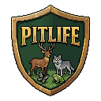

<p align="center">
  
</p>

<h1 align="center">PitLife</h1>

<p align="center">
  <b>2D data-driven ecosystem simulator</b><br>
  Creature che vivono, si nutrono, si riproducono, evolvono e interagiscono<br>
  in un mondo dinamico con 15 biomi, 122+ specie, stagioni orbitali,<br>
  clima, cataclismi e recupero ambientale.
</p>

<p align="center">
  
  
  
  
</p>

---

## Caratteristiche

### Simulazione
- **15 biomi**: DeepOcean, ShallowWater, Beach, Desert, Savanna, Grassland, Forest, DenseForest, Swamp, Tundra, Mountain, Snow, CoralReef, Cave, Volcano
- **Grafica**: sprite dedicati in pixel art 64x64 per le principali specie marine, terrestri e aviarie
- **122+ specie** tra piante, erbivori, carnivori, onnivori, insetti e preistorici
- **Ciclo giorno/notte** con 4 fasi e overlay visivo
- **Stagioni orbitali**: orbita ellittica (e=0.12), perielio/afelio, gradiente latitudinale
- **Clima per-tile**: temperatura da orbita + latitudine + bioma, stress termico, eventi estremi
- **Fiumi meandriformi**: generazione procedurale con percorsi realistici
- **Cataclismi**: asteroidi, ere glaciali, supervulcani, terremoti, siccità, inondazioni — con recupero graduale del terreno
- **Elevazione in metri**: da -700m (oceano profondo) a 4000m (picco montuoso)
- **Decorazioni per-tile**: elementi visivi, onde sull'acqua
- **Audio procedurale**: effetti sonori generati al volo

### Genetica ed Evoluzione
- **Genoma diploide**: 11 loci con alleli, dominanza e ricombinazione
- **Tratti ereditabili**: Speed, Size, Metabolism, Vision, adattamenti climatici
- **Personalità**: Aggression, Sociability, Intelligence, MemorySpan, PlantRecognition
- **Deriva genetica**: fluttuazioni casuali in popolazioni piccole
- **Inbreeding**: coefficiente di parentela e depressione genetica
- **Evoluzione visibile**: colore del genoma riflesso nello sprite
- **Albero filogenetico**: lineage tree per tracciare discendenza ed evoluzione

### Ecologia
- **Rete trofica**: 5 livelli trofici, efficienza energetica 10%
- **Grazing**: erba sui tile, rigenerazione stagionale, espansione
- **Nutrienti suolo**: ciclo NPK, decomposizione carogne fertilizza
- **Atmosfera**: O₂/CO₂ globali, fotosintesi e respirazione
- **Sete**: animali bevono da fiumi e oceani
- **Tossicità**: piante e animali velenosi, apprendimento erbivori
- **Malattie**: epidemie con trasmissione, immunità e recupero
- **Simbiosi**: mutualismo implicito (api-fiori, pesci pulitori)
- **Migrazioni**: home range, movimento stagionale
- **Dinamiche trofiche**: cicli Lotka-Volterra
- **Scarsità d'erba**: penalità dinamica su costo energetico e riproduzione per stabilizzare gli ecosistemi
- **Frutti**: meccanica di spawn, maturazione e consumo

### Comportamento
- **Ciclo attività**: animali diurni/notturni/crepuscolari
- **Memoria spaziale**: ricordo di cibo e pericoli
- **Cuccioli**: infanti protetti dai genitori
- **Corteggiamento**: combattimento tra maschi, selezione sessuale
- **Territorialità**: difesa del branco, home range
- **Socialità**: branchi, stormi, banchi con flocking
- **Difese**: statistiche attacco/difesa basate sul genoma
- **Fuga per bassa energia**: istinto di sopravvivenza dinamico

### UI
- **Tema foresta**: palette verde/marrone con finestre draggable, icone di collasso cliccabili e hover state
- **Shortcut hints**: indicazioni visive sui bottoni per i tasti rapidi (es. ESC) con colori dinamici on-hover
- **Minimap**: angolo in basso a destra con biomi e creature
- **Toolbar**: statistiche, creature, velocità, cataclismi, clima, menu
- **Dashboard clima**: dati orbitali, temperatura per-tile, emisferi
- **HistoryWindow**: grafici per popolazioni e temperature nel tempo
- **SpeciesCyclopedia**: enciclopedia in-game di tutte le specie con hover state e gestione degli empty state
- **I18n**: Italiano/Inglese con toggle nel menu
- **Persistenza**: salvataggio/caricamento mondo, preferenze lingua
- **Loading screen**: barra di caricamento animata

### Performance e Architettura
- **Multi-thread**: world generation parallela, object pooling
- **Resilienza**: isolamento (quarantine) degli aggiornamenti falliti per singola creatura, evitando crash dell'intera simulazione
- **Ottimizzazioni algoritmiche**: rimozione list O(N^2) tramite swap-with-last O(1) (es. `ProcessDeaths`), culling ottimale dei loop e sostituzione radici quadrate con distanze al quadrato (`CataclysmSystem`, `FruitSystem`)
- **Zero-allocation**: ottimizzazioni estese per azzerare le allocazioni (es. Social, Flow, ricerca spaziale e `EcosystemMetrics`)
- **Architettura**: pipeline di simulazione modulare, decomposizione di `Game1` e `InGameUi` in finestre e collaboratori specializzati, e navigazione `MainMenu` ottimizzata con switch expressions
- **Stabilità e Sicurezza**: quarantena fault-tolerant per gli errori di simulazione delle creature, PRNG sicuri (es. seed del mondo e audio procedurale), salvataggi in percorsi di sistema sicuri (`LocalApplicationData`) e fix per le vulnerabilità di path traversal
- **Rendering**: grid culling rigoroso, culling matematico per effetti (es. cataclismi) e culling degli overlay ambientali, tile rendering a due passaggi per minimizzare i texture swap
- **Data-driven**: tutte le logiche (specie, bilanciamento, clima, malattie, comportamenti) in JSON esterno
- **Benchmark**: suite BenchmarkDotNet per regressioni di performance
- **500+ test**: unit test (con supporto headless per CI), property-based test, benchmark

---

## Come giocare

### Toolbar (in basso)

| Bottone | Azione |
|---------|--------|
| **Statistiche** | Popolazioni, specie, gas |
| **Creatura** | Dettagli creatura selezionata |
| **Allinea** | Riordina finestre |
| **< >** | Velocità simulazione (0/1x/2x/4x) |
| **Cataclismi** | Pannello cataclismi |
| **Clima** | Dashboard clima |
| **Storico** | Pannello storico |
| **Menu** | Torna al menu principale |

### Controlli

| Tasto | Azione |
|-------|--------|
| **WASD / Frecce** | Muovi camera |
| **Rotella mouse** | Zoom |
| **Click su creatura** | Seleziona e vedi dettagli |
| **Click su terreno** | Vedi info bioma ed elevazione |
| **Spazio** | Pausa/Riprendi |
| **↑ / ↓** | Aumenta/Riduci velocità |
| **1 / 2 / 3** | Velocità 1x / 2x / 4x |
| **F1** | Debug overlay |
| **F2** | Statistiche |
| **F3** | Dettagli creatura |
| **F4** | Spawn creature |
| **F6** | Editor specie |
| **F7** | Cataclisma casuale globale |
| **C** | Pannello cataclismi |
| **F9** | Dashboard clima |
| **F10** | Pannello storico |
| **G** | SpeciesCyclopedia |
| **ESC** | Annulla selezione / menu principale |

### Spawn creature
1. **F4** → scegli categoria (Piante, Erbivori, Carnivori, Onnivori)
2. Clicca una specie (usa la barra di ricerca)
3. Clicca sulla mappa per spawnare (3 individui in gruppo)

### Cataclismi
1. **C** o toolbar **Cataclismi** → seleziona tipo
2. Clicca sulla mappa per piazzarlo
3. Il terreno cambia visibilmente e recupera gradualmente
4. **F7** per cataclisma casuale globale

### World generation (menu principale)
- **Preset**: Pangea, Continenti, Arcipelago, WetWorld, DryWorld
- **Pianeta**: Earth-like, Small Cold, Large Hot, Super-Earth
- **Continenti**: 1-6 masse
- **Livello mare**: 0-100
- **Mappa**: 96×72, 200×150, 400×300, 800×600

---

## Installazione

```bash
git clone https://github.com/pietrondo/pitlife.git
cd PitLife
dotnet build
dotnet run
```

**Requisiti:** .NET 10.0+, scheda video con supporto OpenGL, Windows/macOS/Linux

---

## Struttura del progetto

| Directory | Contenuto |
|-----------|-----------|
| `Simulation/` | Ecosystem, Creature, Genome, Behaviors, Climate, Disease, Cataclysms, WorldGenerator |
| `Rendering/` | PixelWorldRenderer, CreatureRenderer, Minimap, DayNightCycle, Camera |
| `UI/` | MainMenu, SpawnPanel, InGameUi, CataclysmPanel, SpeciesEditor, UiWindow |
| `Core/` | Logger, AssetRegistry, SpeciesCatalog, Config |
| `Localization/` | I18n Italiano/Inglese |
| `Content/` | Assets, sprite, font, config JSON |
| `tests/` | 500+ test (xUnit, property-based, benchmark) |

---

## Sviluppo

PitLife usa C# con **MonoGame**. Per estendere la simulazione:

- **Specie**: modifica `BuiltinSpecies.cs` o `Content/species.json`
- **Comportamenti**: implementa `ICreatureBehavior` in `Simulation/Behaviors/`
- **Biomi**: aggiungi a `BiomeType.cs`, `Tile.cs`, renderer
- **Config**: modifica i JSON in `Content/config/` per bilanciamento

### Tech stack

| Componente | Tecnologia |
|------------|------------|
| Linguaggio | C# 14 (.NET 10) |
| Game framework | MonoGame 3.8 |
| Test | xUnit, BenchmarkDotNet |
| CI | GitHub Actions (Ubuntu + Windows) |
| Pixel art | PixelLab |

---

## Licenza

MIT — vedi [LICENSE](LICENSE)
