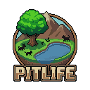

<p align="center">
  
</p>

<h1 align="center">PitLife</h1>

Clone di SimLife (Maxis 1992) — simulazione di ecosistema con genetica, mutazioni e catena alimentare.

- **Engine**: MonoGame 3.8 (DesktopGL)
- **Grafica**: PixelLab pixel art
- **Target**: .NET 9
- **Lingua UI**: italiano predefinito, catalogo i18n italiano/inglese

## Eseguire

```bash
dotnet run
```

Il menu principale supporta mouse, frecce e Invio. La finestra Opzioni permette di attivare o disattivare lo schermo intero.

Durante la simulazione: WASD/frecce per muovere la camera, scroll per zoom, spazio per la pausa, F2/F3 per le finestre e ESC per chiudere la finestra attiva o tornare al menu.

## Test

```bash
dotnet test PitLife.sln
```

La suite copre la simulazione deterministica, i biomi, lo spatial grid, i limiti della camera e la gestione delle finestre.

## Creature

| Classe      | Specie                                  |
|-------------|-----------------------------------------|
| Piante      | Bush, Flowers, Mushroom, GrassTuft, Cactus |
| Erbivori    | Gazelle, Rabbit, Deer, Sheep            |
| Carnivori   | Wolf, Fox, Lynx, Tiger                  |
| Onnivori    | Bear, Boar, Raccoon                     |

Ogni creatura ha un genoma unico con 6 geni che mutano alla riproduzione.
